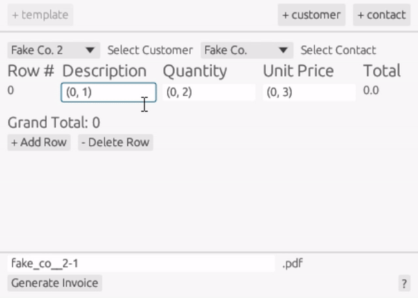
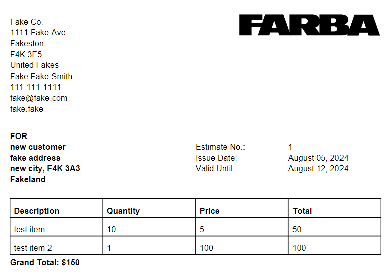

# Invoicy 

## A simple way to send invoices

In an effort to support small businesses Invoicy provides the essentials for generating clean looking documents quickly. I will keep things updated here as improvements are made, feel free to chime in with ideas that you think may be useful (that aren't in my list already).

# Features
- Fast pdf generation
- Saves any contacts and customers that are generated
- cross platform (Mac, Windows, Linux)

## Getting Started
In order to be able to change the image on the invoice you would need to download everything locally. You can do this by:
- cloning the repository through your terminal
- downloading everything as a zip file

Once this has been done you need to make sure you have the latest version of Rust and cargo [installed](https://www.rust-lang.org/tools/install).

After all the downloads are finished navigate to the folder in your terminal and run `cargo run`.

If you run into any problems post an issue I will try to resolve it.

## Demo

## Result
Below is a screenshot of the pdf file that is genrated after hitting **Generate Invoice**.
 

# Future Plans
- google drive backup
- templating ability to allow for more custom invoice structures
- PDF preview screen
- Earnings reporting which uses historical data

